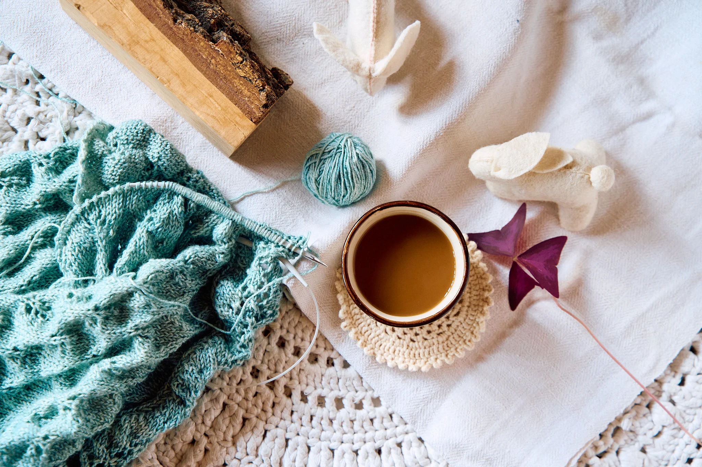

Sokan kérdezitek, hogyan készül egy-egy baba. Most beengedlek a műhelybe.

## Az anyagok

Mindig természetes anyagokkal kezdek: gyapjúval, pamuttal, vászonnal. Ezeket gondosan válogatom — fontos, hogy puhák és tartósak legyenek, hiszen egy baba sok ölelést megél.

## A varrás és a kitömés

A testet kézzel varrom és gyapjúval töltöm meg. Ez adja a baba puha, mégis formatartó tapintását.

## Az arc

A végén jön a kedvenc részem: az arc kézi hímzése. Ez az a pillanat, amikor a baba életre kel, és mindegyik kicsit más lesz.

Köszönöm, hogy beengedtelek egy kicsit a műhelybe. Ha kérdésed van, írj bátran!
